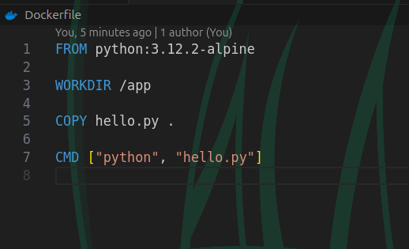
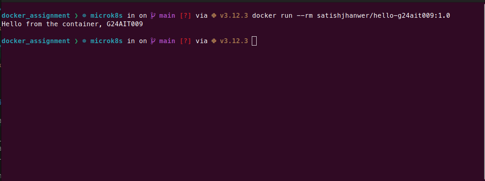
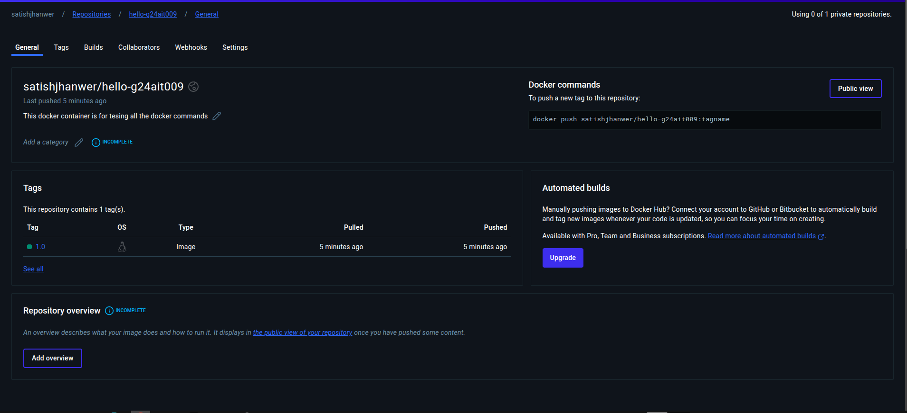

# Docker Assignment Report

- **Roll No:** G24AIT009
- **Name:** Satish Jhanwer
- **Date:** 26th Jan 2025
- **Github Repo:** [https://github.com/satishjhanwer/MLOps-2025-Docker](https://github.com/satishjhanwer/MLOps-2025-Docker)
- **Docker Repo:** [https://hub.docker.com/r/satishjhanwer/hello-g24ait009](https://hub.docker.com/r/satishjhanwer/hello-g24ait009)

---

## **1. Introduction**

This report outlines the process of building and deploying a custom Docker image using the official Python Alpine base image. The image executes a Python script that outputs the message:  
`Hello from the container, G24AIT009`

The steps include:

1. Pulling the official Python Alpine image.
2. Creating and testing a custom Docker image.
3. Pushing the image to DockerHub for public access.

---

## **2. Steps to Complete the Assignment**

### **Step 1: Pull the Official Python Image**

To use a lightweight Python image, the `python:3.12.2-alpine` base image was pulled with the command:

```bash
   docker pull python:3.12.2-alpine
```

### **Step 2: Set Up a Working Directory**

A directory was created to organize the files:

```bash
   mkdir docker_assignment
   cd docker_assignment
```

### **Step 3: Create the `hello.py` File**

Inside the directory, a Python script named `hello.py` was created with the following content:

```python
   print("Hello from the container, G24AIT009")
```

### **Step 4: Write the `Dockerfile`**

A `Dockerfile` was created to define the instructions for building the Docker image:

```Dockerfile
   FROM python:3.12.2-alpine
   WORKDIR /app
   COPY hello.py .
   CMD ["python", "hello.py"]
```

### **Step 5: Build the Custom Docker Image**

The Docker image was built with the following command:

```bash
   docker build -t satishjhanwer/hello-g24ait009:1.0 .
```

### **Step 6: Test the Docker Image**

The image was tested locally to verify its functionality:

```bash
   docker run --rm satishjhanwer/hello-g24ait009:1.0
```

**Expected Output:**

```plaintext
   Hello from the container, G24AIT009
```

### **Step 7: Push the Image to DockerHub**

**1. Log in to DockerHub:**

```bash
   docker login -u satishjhanwer
```

**2. Push the image to the DockerHub repository:**

```bash
   docker push satishjhanwer/hello-g24ait009:1.0
```

Once pushed, the image was accessible publicly at: [Docker Repo](https://hub.docker.com/r/satishjhanwer/hello-g24ait009)

---

## **3. Issues Faced and Solutions**

### **Issue 1: Docker Installation Challenges**

Some issues were encountered during Docker installation. These were resolved by following the official [Docker Installation Guide](https://docs.docker.com/get-docker/) and ensuring all system dependencies were met.

### **Issue 2: Docker Login issue**

When I attempted docker login it was throwing errors related to credential storage in plain text format. To resolve this error first I have configured `{"credsStore": "pass"}` inside `~/.docker/config.json` after that I have created a `gpg key` and using `pass` package I have configured generated `gpg` into `pass` store. After that I have set up `docker-credential-pass` in my machine. After that when I tried `docker login` it was successful without any errors.

More information can be found here.
[Docker Credential Helper](https://github.com/docker/docker-credential-helpers)

---

## **4. Conclusion**

This assignment provided hands-on experience with:

- Pulling and using a base image.
- Creating a custom Docker image.
- Publishing and sharing Docker images on DockerHub.

I gained a deeper understanding of Docker and containerized application workflows.

---

## **5. Screenshots**

### **1. Dockerfile Content**



### **2. Successful Docker Image Test**



### **3. DockerHub Repository**



---
